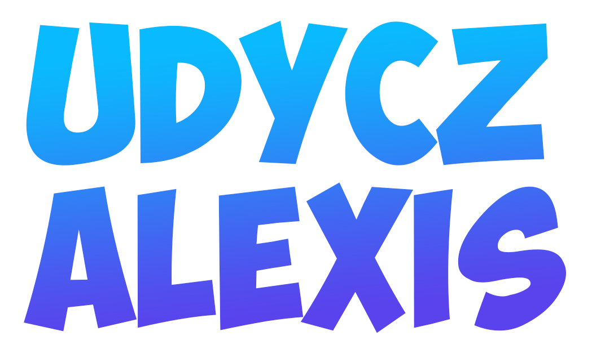

    
    
C#, JS/TS, PHP and a little 🐍

    
    
    
    
    

## Introduction

Welcome to my GitHub profile! I'm a 19-year-old French developer who is passionate about coding and creating software solutions. With a keen interest in web and software development, my ultimate goal is to establish myself as a skilled and versatile developer in these domains.

As you explore my GitHub repositories, you'll find a diverse collection of projects that demonstrate my passion for coding, problem-solving, and my dedication to becoming a skilled web and software developer.

I genuinely appreciate everyone who takes the time to visit my profile, browse my projects, and provide feedback. Your support and encouragement mean a lot to me as I continue to grow as a developer.
Feel free to reach out if you have any questions, suggestions, or collaboration opportunities. Let's connect and embark on this coding journey together!

PS: 
- 🤙🏼 Optimist, and crazy about programming (C# 💘).
- 🦝 Racoon enthusiastic.
- 🖱️ New tech enjoyer !

## Stats

    

## Discord

    

